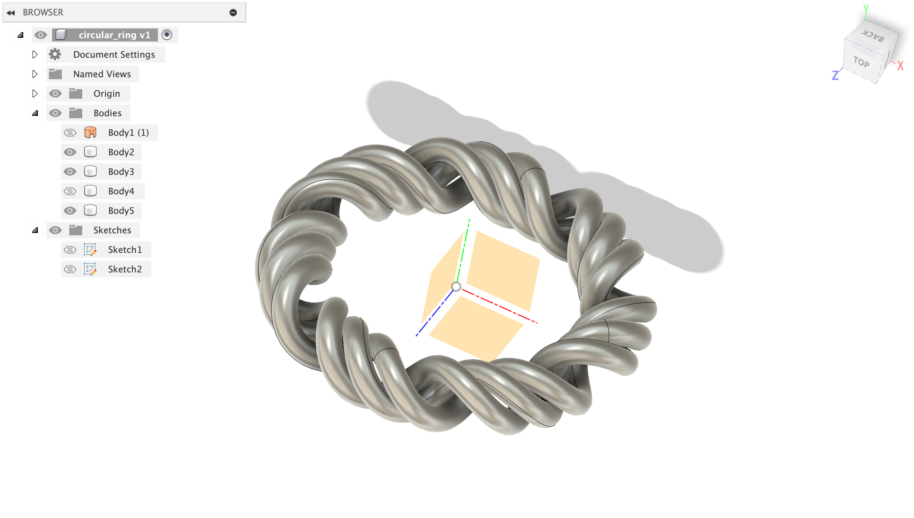
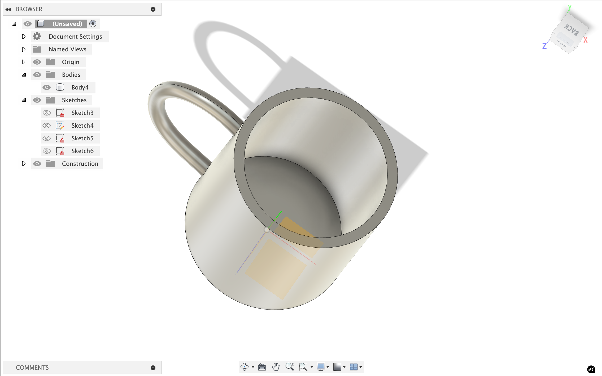

# Week 2

Making parametric design and vinyl cutting

## Vinyl Cutting

I learned to do vinyl cutting using the [open source tool](https://modsproject.org/) developed by Neil and the Media Lab on the Roland Vinyl Cutter.

I've also been playing around a lot on Fusion360. I initially tried using FreeCAD but after struggling around with it for ~3+ hours, I decided to stick with Fusion, since I've used it before and I find the sketch to 3d workflow much more intuitive. 

I'm going to try to make this design I made in Figma (for my favorite band) on the Vinyl cutter: 

Here's a photo of the modproject interface when I put in a doodle of a pikachu batman: 

. 

This is inspired by my consistent profile photo:

Final product (ignore the background, I stuck it on my notebook that had a photo of snoopy in a batsuit): 

## Laser Cutting 

Things that we figured out about the Laser Cutter in the EECS makerspace is that the kerf is about 0.0049 inches, and the clearance is about -0.0045 inches, meaning that we should design for an interference fit.

**hardware setup:**

- 75w co2 laser (large machine)
    - generates infrared light that gets focused to a tiny point. when this concentrated energy hits material, it instantly heads and vaporizes it along the programmed path.
    - what “kerf” means (which is 0.0049’’ average) is the width of material that gets completely removed by the beam
- 60w co2 laser (small machine)
- universal laser systems hardware
- universal control software for parameter control
- inkscape for vector design and job sending

**design process**

1. design vectors → red lines w/ 0.001’’ weight is full cuts and blue lines (0.001’’ weight) is engraving/scoring
2. focus the bean using the focusing stick until it just touches material surface
3. set parameters: 100% power, 30% speed baseline, 500 ppi
4. ctrl+p to send job to universal control software
5. turn on air compressor, hit green button

Things to remember!

- focus accuracy determines cut quality—we use the white part of focusing stick
- kerf compensation is needed in design (if very precise)
- material thickness affects join clearance (-0.0045’’ interference fit on cardboard)
- the bed moves during focusing, laser tracks the material plane

Here's the final produce of the various building blocks I made:

I also made an engraving cut of an album I love, called Gone Now by Bleachers. It came out relatively okay on cardboard, even though some teaching with the strength of hte cuts and using a different material will probably make it come out better: 

## CAD

I watched this [video](https://www.youtube.com/watch?v=r5kpEqka7Og) on making a wheel and made this:

I also tried to make a CAD of my ring, but it is not very perfect, so maybe I'll try to learn how to do this more professionally: 

	
	
	

Todos:
- [x] Vinyl cutting
- [ ] Builder kit w/ Laser Cutting!