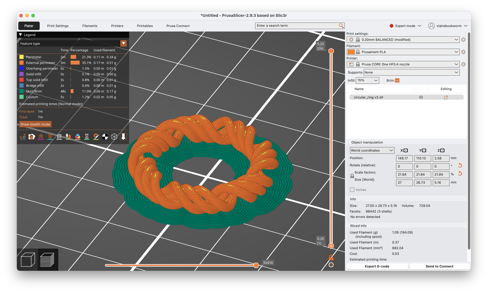
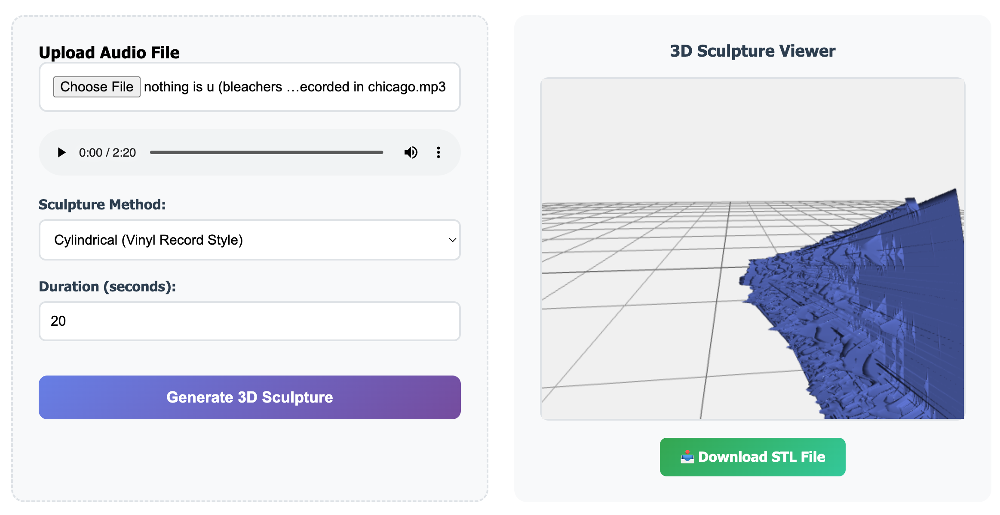
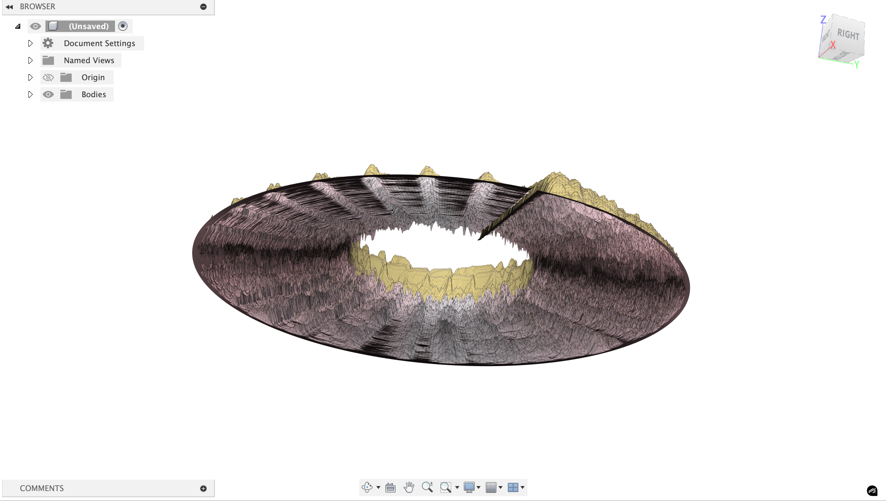
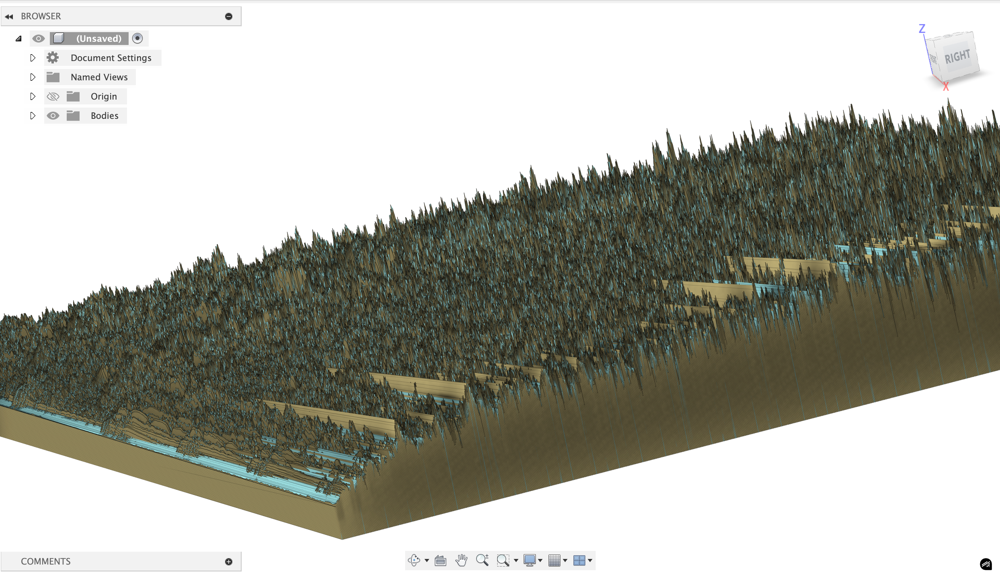

# week 4: 3d scanning and printing

## Notes
Anisotropic - varying properties based on direction. For example, wood is stronger along the grain than across it. (Some printing material is like this when you build supports.)

Space between the print-head and the bed is very small and you should be careful. 

Concepts:
- Electroplating
- Stereolithography
- Binder Jetting 

The printer the EEECS makerspace has is the [Prusa Core One](https://www.prusa3d.com/product/prusa-core-one/), an enclosed corexy machine.

It has a 250x220x270mm build volume and can hit 600mm/s print speeds. It also has auto bed leveling, filament runout detection, and power panic recovery. Corexy means the print head moves via belts in an xy coordinate system rather than the bed moving, which is much faster and has less vibration. The enclosure helps with abs/petg temperature stability and reduces warping.

What is possible with this? Probably you can print much faster and a lot more materials become much more reliable. PVA

Types of 3d printing and support materials

- **PVA**: polyvinyl alcohol. Dissolves in water; you can print model in normal plastic and supports in pva + dunk in water
- **HIPS**: high impact polystyrene. It dissolves in limonen (citrus solvent), its much cheaper than PVA.
- **ABS** — what lego is made of, strong and heat resistance but shrinks as it cools so it warps and cracks without an enclosure. Acetone-weldable
- **asa** = basically outdoor abs, uv-stable. mostly the same properties but won't degrade in sunlight
- **pc** = polycarbonate, bulletproof glass material. It’s incredibly tough, heat resistant to ~140C, but needs ~300C nozzle temps
- **petg** = like pla's stronger cousin. easier to print than abs, stronger than pla, clear variants available. good middle ground
- **pla** = prints easy, biodegradable, but melts in a hot car.


*Notes*:
j55 prime 3d print  - inkjet prints droplets of colored material

hangprinter - anchor in the room and it hands down to print things 

file formats:
- STL - list of triangles, has no units
- PLY - a bit better
- AMF / 3MF - color format that prints can learn to use

**Terminology**:
- *G-code*: The low-level programming language used to control 3D printers and CNC machines; it specifies movement, temperature, and other instructions.
- *Blender*: A powerful open-source 3D modeling software; supports texture mapping, sculpting, animation, and more.
- *MeshLab*: A tool for viewing, editing, and cleaning 3D mesh files; useful for preparing models for printing.
- *Slicing software*: Converts 3D models into layers and generates G-code for printers; examples include PrusaSlicer, Cura, and Simplify3D.
- *Firmware*: Embedded software running on the printer’s hardware; manages motion, temperature, and safety features.
- *model-viewer*: A web component that lets you embed interactive 3D models in web pages.
- *Photogrammetry*: Technique that reconstructs 3D objects by analyzing multiple photos taken from different angles; can be done with a smartphone.
- *Speckle pattern scanning*: Projects a random dot pattern onto an object and tracks dot movement to capture surface geometry.
- *Ferret Pro*: A stereo vision system that uses two cameras to capture depth information for 3D scanning.

## 3D Printing

I first 3d printed the concentric ring that I designed in week 2: 


Here's a time-lapse of the printing process (it was just 7 minutes!). First, I sliced the model in Prusa Slicer, which generated the gcode for the printer. The filament is **Prusament PLA** and I used a HF0.4 nozzle and 15% infill. Since the ring doesn't have that much grip to the base, I enabled *brim*, which adds a single layer of extra material around the base of the print to help it stick to the bed.



<video src="https://hc-cdn.hel1.your-objectstorage.com/s/v3/35e463ba069c4313782288b6e1879bd2428015de_img_4007.mp4" controls height="400" style="display: block"></video>


## Audio Sculptures

I'm really quite interested in interesting ways to interface with audio and signals. The idea behind this project is turning audio files into 3d sculptures and then (hopefully) decoding it using 3d scanning. There were some obvious issues with this idea (signals are just too granular to be able to both print and scan without losing a lot of the information), but I still think it's a really cool idea.

First, you need to do some pre-processing of the audio file that the user can upload: 

**step 1: audio preprocessing**
- load audio file (wav/mp3)  
- apply fft to get frequency domain data
- create spectrogram: `librosa.stft()` gives you frequency bins over time
- result: 2d array where `spectrogram[freq_bin][time_frame] = amplitude`

I’m taking signal processing so this is strangely topical to what we’re literally *just* covering: 

Any song file is just a sequence of amplitude values over time - like `[0.2, -0.1, 0.5, -0.3, ...]` at 44.1khz sampling rate. this is the "time domain" - you can see when sounds happen but not what frequencies they contain.

**fft (fast fourier transform)**: this is the mathematical magic that converts time→frequency. it takes a chunk of audio (say 2048 samples ≈ 46ms) and tells you "this chunk contains 200hz at 0.3 amplitude, 440hz at 0.8 amplitude, 1200hz at 0.1 amplitude" etc.

we need chunks because music changes over time - a guitar chord at second 5 has different frequencies than the drum hit at second 6. so we slide a window across the entire song, computing fft for each window position.

**spectrogram creation**: stack all these fft results together. now you have a 2d array where:

- x-axis = time (each column is one fft window)
- y-axis = frequency (each row is a frequency bin like "200-210hz")
- color/value = amplitude (how loud that frequency was at that time)

Spectrograms kind of look like heatmaps. This is the spectrogram for Hayley William’s song Ice in my OJ (first 10 seconds):


There is numpy-stl and trimesh that can generate and work with meshes in python. 

Here's an example of a audio sculpture that's generated in a helical structure. This is the breakdown of the algorithm I used: 

```cpp
t_parametric = (time / duration) × 4π  // 2 full rotations
radius = base_radius + frequency_offset
x = radius × cos(t_parametric)
y = radius × sin(t_parametric)
z = t_parametric × pitch / (2π)  // vertical progression
```

Time creates a helix (the spiraling staircase) and the frequency controls radial position and amplitude affects the thickness/displacement. The result is a DNA-like double helix structure that encodes the audio data in 3D space.


There's a bunch of other versions I created (Using Claude) that also look really cool but were too complex to 3d print (just like the above image). I also made a little webpage that takes in an audio file (wav/mp4) and processes a certain snippet of it to generated a 3d model.  

<div style="display: flex; gap: 1em; justify-content: center; align-items: flex-start;">
	
	
	
</div>